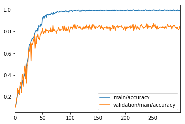
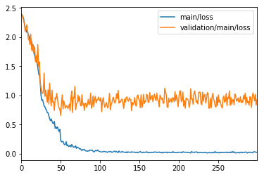

# chainer-c3d

Sample source of C3D written in Chainer.

This code is inspired by [c3d-keras](https://github.com/axon-research/c3d-keras), but it is implemented from scratch.
Currently, I've not tried fine-tuning from pre-trained model of [original one](https://github.com/facebook/C3D).
The original paper is [here](https://arxiv.org/abs/1412.0767).

Requirement:

* Chainer 3.2 (It may work on the other versions.)

This sample is forked from [chainer/examples/cifar@97315f](https://github.com/chainer/chainer/tree/97315ffff04622a12d49b028c0fba21535e51532/examples/cifar).
Please refer to [here](https://github.com/chainer/chainer/blob/97315ffff04622a12d49b028c0fba21535e51532/LICENSE) about license.

Copyright (c) 2017 ikeyasu.

# Result

Accuracy:



Loss:



# Dataset

You can refer to [tools/README.md](tools/README.md) for a dataset generation.

We use [UCF11](http://crcv.ucf.edu/data/UCF_YouTube_Action.php) which is small dataset for
human activity detection.
The original paper uses Sports-1M dataset but it is not tried yet in this sample.

You need to download the dataset and convert to jpeg images. Please see also [tools/README.md](tools/README.md) for detail.

Requirement:

* FFmpeg
* GNU Parallel

Download UCF11.

```
$ wget http://crcv.ucf.edu/data/UCF11_updated_mpg.rar
$ mkdir videos
$ pushd videos
$   unar e UCF11_updated_mpg.rar
$ popd
```

Converting to images.

```
$ ls videos/*.mpg | parallel --no-notice -j8 ./tools/video_to_images.sh  {}
```

Make folders for resized and cropped images.

```
$ ls videos/*/*.jpg | parallel --no-notice -j 200 'echo `dirname {}`' | uniq > dirs
$ cat dirs | sed 's/videos/ucf11_160x120\/images/' | xargs  mkdir -p
$ cat dirs | sed 's/videos/ucf11_112px\/images/' | xargs  mkdir -p
$ rm dirs
```

Resize to 160x120 (half).

```
$ ls videos/*/*.jpg | parallel -j20 'convert -resize 160X120 {} `echo {} | sed "s/videos/ucf11_160x120\/images/"`'
```

Resize and crop to 112x112 (to compute mean image).

```
$ ls videos/*/*.jpg | parallel -j20 'python tools/resize.py -c 112 -i {} -o `echo {} | sed "s/videos/ucf11_112px\/images/"`'
```

Now, you have two datasets.

* ./ucf11_160x120/images: for training
* ./ucf11_112px/images: for comuputing mean image

Compute mean image for ucf11_112px.

```
$ pushd ucf11_112px
$   find . | grep .jpg$ > list
$   python ../tools/compute_mean.py --root . list
$ popd
```

Some videos have very small number of frames. These videos cannot use for training/testing.
The following command counts number of files for each video.
Please find videos which have images less than 10, and remove the folders.

```
$ pushd ucf11_160x120/images/
$   ls | parallel -j50 'echo `ls -1 {} | wc -l` {}' | sort -n > ../counts
$   mkdir ../ignored
$   grep '^[0-9] ' ../counts | cut -d ' ' -f 2 | xargs mv -I '{}' mv {} ../ignored
$ popd
```

Split test dataset. Choise 300 images randomly.

```
$ pushd ucf11_160x120/images
$   mkdir ../tests
$   ls | shuf | head -n 300 | xargs -I '{}' mv {} ../tests/
$ popd
```

Now, you have..

* ./ucf11_160x120/images: for training
* ./ucf11_160x120/tests: for validaton
* ./ucf11_160x120/ignored: Small number of frames. Not using.
* ./ucf11_112px/images: for comuputing mean image
* ./ucf11_112px/mean.npy: mean image array


# Training

```
$ python train.py -g 0 --arch c3d --batchsize 30 --train-data ucf11_160x120/images/ --test-data ucf11_160x120/tests/ --optimizer sgd --mean ucf11_112px/mean.npy --frames 9
```

Please refer to `python train.py --help` for detail.

[The original paper](https://arxiv.org/abs/1412.0767) uses 16 frames but this sample uses 9 frames because of my GPU limitation.

# Prediction

By image directory.

```
$ python predict.py -a c3d --model mlp.model --mean ucf11_112px/mean.npy --image-dir ucf11_160x120/tests/v_jumping_22_03/
```

By dataset.

```
$ python predict.py -a c3d --model mlp.model --mean ucf11_112px/mean.npy  -i ucf11_160x120/tests
```
